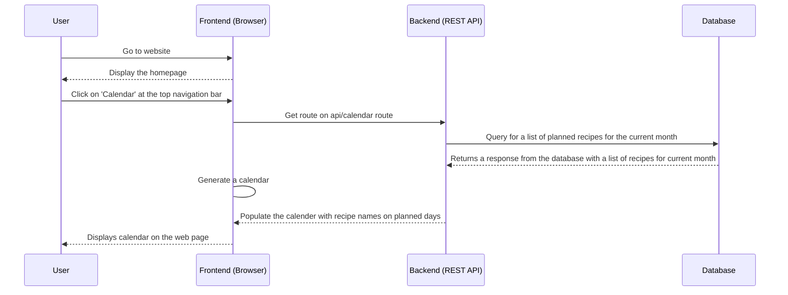

```mermaid
sequenceDiagram
    User->>Frontend (Browser): Go to website
    Frontend (Browser)-->>User: Display the homepage
    User->>Frontend (Browser): Click on 'Calendar' at the top navigation bar
    Frontend (Browser)->>Backend (REST API): Get route on api/calendar route
    Backend (REST API)->>Database: Query for a list of planned recipes for the current month
    Database-->>Backend (REST API): Returns a response from the database with a list of recipes for current month
    Frontend (Browser)->Frontend (Browser): Generate a calendar
    Backend (REST API)-->>Frontend (Browser): Populate the calender with recipe names on planned days
    Frontend (Browser)-->>User: Displays calendar on the web page
```