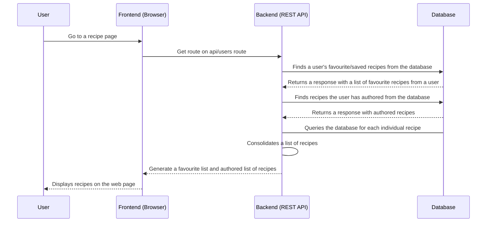

```mermaid
sequenceDiagram
    User->>Frontend (Browser): Go to a recipe page
    Frontend (Browser)->>Backend (REST API): Get route on api/users route
    Backend (REST API)->>Database: Finds a user's favourite/saved recipes from the database
    Database-->>Backend (REST API): Returns a response with a list of favourite recipes from a user
    Backend (REST API)->>Database: Finds recipes the user has authored from the database
    Database-->>Backend (REST API): Returns a response with authored recipes
    Backend (REST API)->Database: Queries the database for each individual recipe
    Backend (REST API)->Backend (REST API): Consolidates a list of recipes
    Backend (REST API)-->>Frontend (Browser): Generate a favourite list and authored list of recipes
    Frontend (Browser)-->>User: Displays recipes on the web page
```