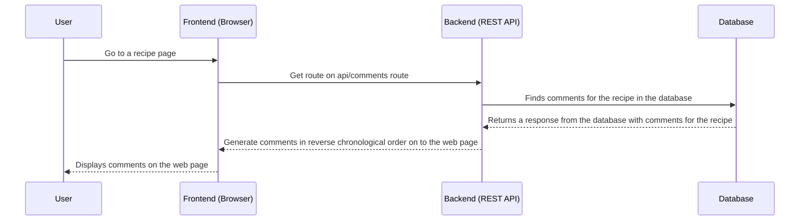

```mermaid
sequenceDiagram
    User->>Frontend (Browser): Go to a recipe page
    Frontend (Browser)->>Backend (REST API): Get route on api/comments route
    Backend (REST API)->>Database: Finds comments for the recipe in the database
    Database-->>Backend (REST API): Returns a response from the database with comments for the recipe
    Backend (REST API)-->>Frontend (Browser): Generate comments in reverse chronological order on to the web page
    Frontend (Browser)-->>User: Displays comments on the web page
```