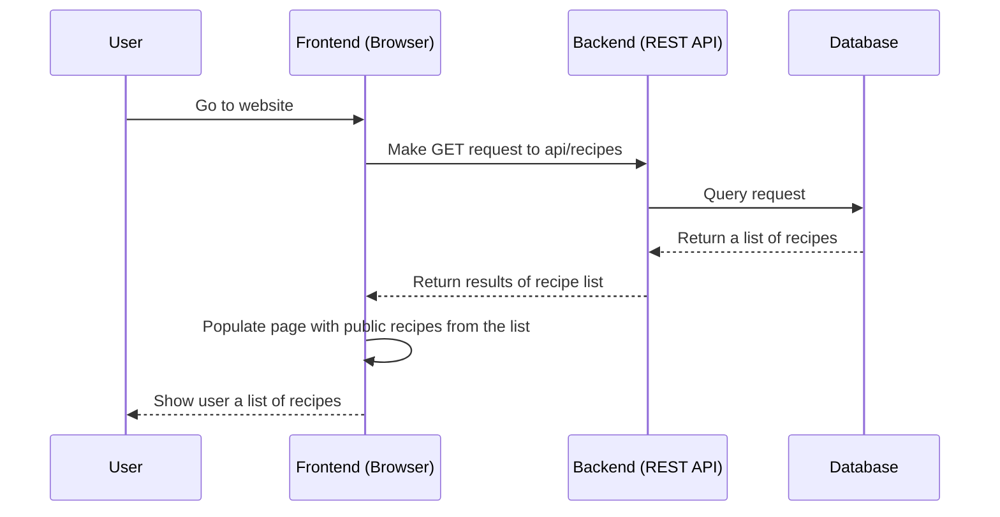

```mermaid
sequenceDiagram
    User->>Frontend (Browser): Go to website
    Frontend (Browser)->>Backend (REST API): Make GET request to api/recipes
    Backend (REST API)->>Database: Query request
    Database-->>Backend (REST API): Return a list of recipes
    Backend (REST API)-->>Frontend (Browser): Return results of recipe list
    Frontend (Browser)->>Frontend (Browser): Populate page with public recipes from the list
    Frontend (Browser)-->>User: Show user a list of recipes
```