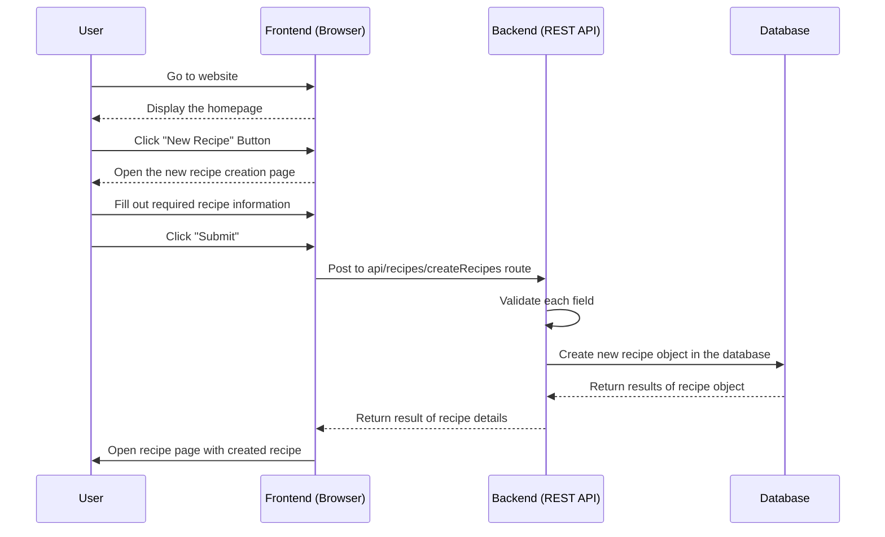

```mermaid
sequenceDiagram
    User->>Frontend (Browser): Go to website
    Frontend (Browser)-->>User: Display the homepage
    User->>Frontend (Browser): Click "New Recipe" Button
    Frontend (Browser)-->>User: Open the new recipe creation page
    User->>Frontend (Browser): Fill out required recipe information
    User->>Frontend (Browser): Click "Submit"
    Frontend (Browser)->>Backend (REST API): Post to api/recipes/createRecipes route
    Backend (REST API)->>Backend (REST API): Validate each field
    Backend (REST API)->>Database: Create new recipe object in the database
    Database-->>Backend (REST API): Return results of recipe object
    Backend (REST API)-->>Frontend (Browser): Return result of recipe details
    Frontend (Browser)->>User: Open recipe page with created recipe
```