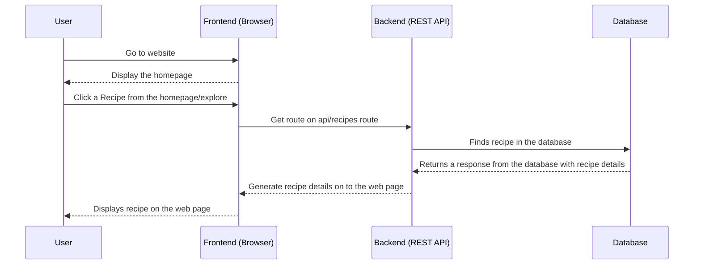

```mermaid
sequenceDiagram
    User->>Frontend (Browser): Go to website
    Frontend (Browser)-->>User: Display the homepage
    User->>Frontend (Browser): Click a Recipe from the homepage/explore
    Frontend (Browser)->>Backend (REST API): Get route on api/recipes route
    Backend (REST API)->>Database: Finds recipe in the database
    Database-->>Backend (REST API): Returns a response from the database with recipe details
    Backend (REST API)-->>Frontend (Browser): Generate recipe details on to the web page
    Frontend (Browser)-->>User: Displays recipe on the web page
```