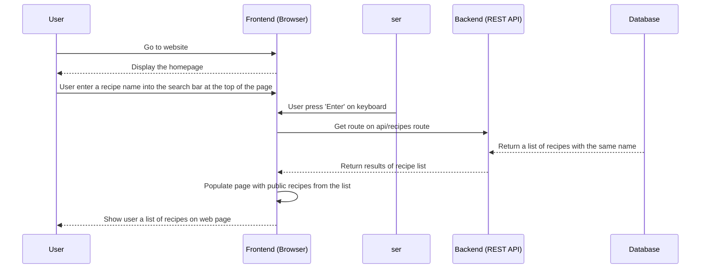

```mermaid
sequenceDiagram
    User->>Frontend (Browser): Go to website
    Frontend (Browser)-->>User: Display the homepage
    User->>Frontend (Browser): User enter a recipe name into the search bar at the top of the page
    ser->>Frontend (Browser): User press 'Enter' on keyboard
    Frontend (Browser)->>Backend (REST API): Get route on api/recipes route
    Database-->>Backend (REST API): Return a list of recipes with the same name
    Backend (REST API)-->>Frontend (Browser): Return results of recipe list
    Frontend (Browser)->>Frontend (Browser): Populate page with public recipes from the list
    Frontend (Browser)-->>User: Show user a list of recipes on web page
```