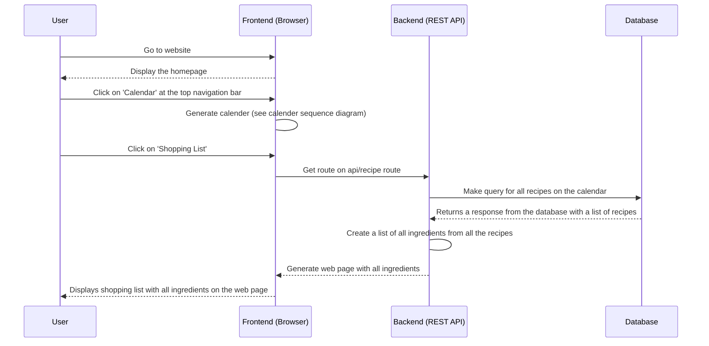

```mermaid
sequenceDiagram
    User->>Frontend (Browser): Go to website
    Frontend (Browser)-->>User: Display the homepage
    User->>Frontend (Browser): Click on 'Calendar' at the top navigation bar
    Frontend (Browser)->Frontend (Browser): Generate calender (see calender sequence diagram)
    User->>Frontend (Browser): Click on 'Shopping List'
    Frontend (Browser)->>Backend (REST API): Get route on api/recipe route
    Backend (REST API)->>Database: Make query for all recipes on the calendar
    Database-->>Backend (REST API): Returns a response from the database with a list of recipes
    Backend (REST API)->Backend (REST API): Create a list of all ingredients from all the recipes
    Backend (REST API)-->>Frontend (Browser): Generate web page with all ingredients
    Frontend (Browser)-->>User: Displays shopping list with all ingredients on the web page
```