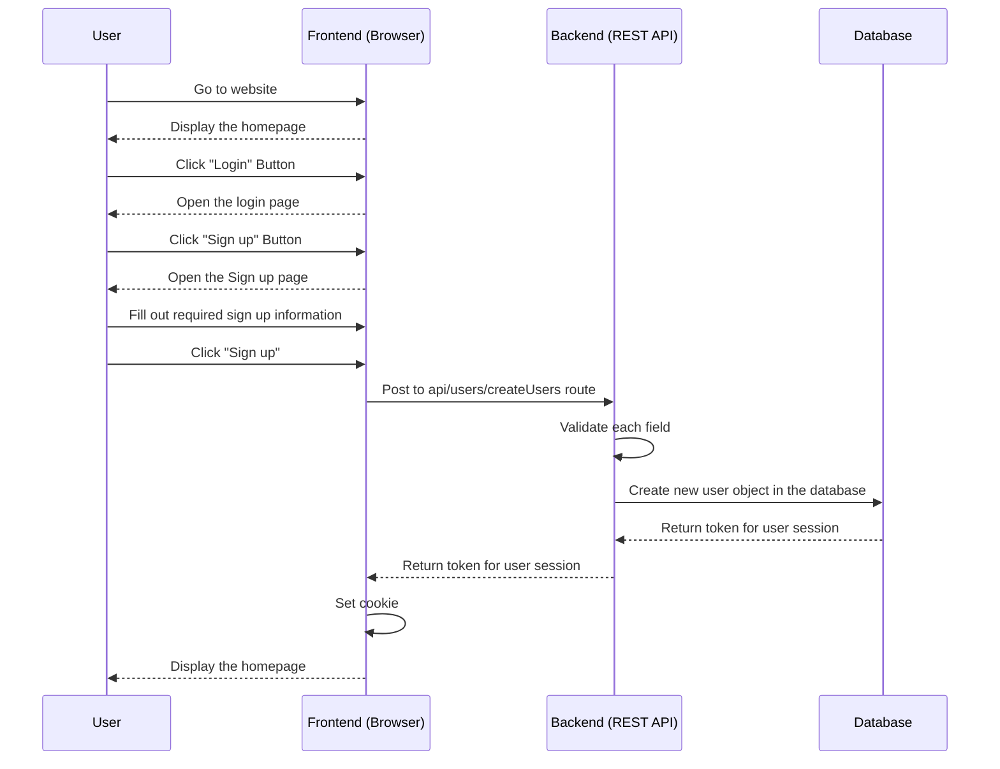

```mermaid
sequenceDiagram
    User->>Frontend (Browser): Go to website
    Frontend (Browser)-->>User: Display the homepage
    User->>Frontend (Browser): Click "Login" Button
    Frontend (Browser)-->>User: Open the login page
    User->>Frontend (Browser): Click "Sign up" Button
    Frontend (Browser)-->>User: Open the Sign up page
    User->>Frontend (Browser): Fill out required sign up information
    User->>Frontend (Browser): Click "Sign up"
    Frontend (Browser)->>Backend (REST API): Post to api/users/createUsers route
    Backend (REST API)->>Backend (REST API): Validate each field
    Backend (REST API)->>Database: Create new user object in the database
    Database-->>Backend (REST API): Return token for user session
    Backend (REST API)-->>Frontend (Browser): Return token for user session
    Frontend (Browser)->>Frontend (Browser): Set cookie
    Frontend (Browser)-->>User: Display the homepage
```